# Claude Pico Desktop Buddy — Build Guide

A small BLE buddy for [Claude Desktop](https://claude.ai/download). Raspberry Pi Pico 2 W, Pimoroni Display Pack 2.8, optional battery, 3D-printed case in the shape of Clawd. Pairs over Bluetooth Low Energy using Anthropic's Hardware Buddy protocol.

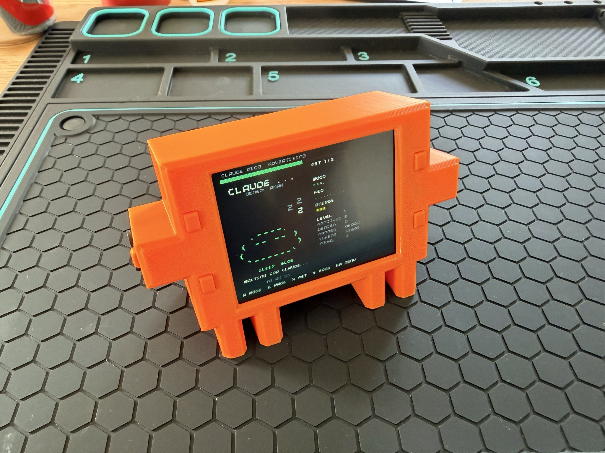

This was a weekend side project. The CAD is in `.step` so you can edit it — please do, mine has obvious things to improve.

- Repo: [../README.md](../README.md)
- Firmware notes: [../docs/hardware-build.md](../docs/hardware-build.md), [../docs/software-setup.md](../docs/software-setup.md)
- Printable files (`.stl` and `.step`): [CAD/](CAD/)
- Photos used in this guide: [Photos_web/](Photos_web/)

---

## Why this exists

It started as something to do when I'd run out of Claude usage and was waiting for the next 5-hour block to roll. [Felix's Hardware Buddy work](https://github.com/anthropics/claude-desktop-buddy/commits?author=felixrieseberg) was already on the list of things I wanted on my desk. Cambridge has the upside of a Raspberry Pi store you can wander into at lunch, so I did — came back with a Pico 2 W, and then had to port the whole thing to RP2350.

The Display Pack 2.8 was the best value at this size. E-ink was tempting but too slow for a buddy that should react in real time. A bigger panel would have made it too big to live on top of my Mac mini, or to come into the kitchen with me when I'm cooking and the agents are coding.

---

## Two builds, same firmware

The minimum build is a **Pico 2 W and a Display Pack**. That's it. Plug it into USB, flash the firmware, pair with Claude Desktop. If you're happy with it tethered to a USB cable on your desk, stop here — you have a working buddy.

The portable build adds the **LiPo SHIM and a battery** so you can carry it around. The case is designed around the portable build — the rear panel has a battery cavity and the screw posts assume the SHIM stack height — but a tethered minimum build will run the same firmware identically.

Everything below describes the portable build. If you're doing the minimum build, skip the SHIM solder step and the battery steps; the rest is the same.

---

## 1. What you need

### Electronics

| Qty | Part | Source | Notes |
|----:|------|--------|-------|
| 1 | Raspberry Pi Pico 2 W with headers | [Pimoroni / Pi Hut / official](https://shop.pimoroni.com/) | Soldered headers, not bare pads. |
| 1 | Pimoroni Pico Display Pack 2.8 | `PIM715` | 320×240 IPS, four buttons, RGB LED. |
| 1 | Pimoroni LiPo SHIM for Pico | `PIM557` | Portable build only. |
| 1 | LiPo battery, 2000 mAh, 3.7 V, JST-PH | PKCELL LP803860 in mine | Portable build only. Any 3.7 V LiPo with a JST-PH plug in roughly that footprint will fit the cavity. |
| 1 | USB-micro cable, **or** USB-C cable + USB-micro-to-USB-C adapter | generic | The case window only fits a thin micro plug or the adapter — see note below. |

**About the USB connector.** The Pico is USB-micro. The case has a cutout that's larger than a bare micro plug — large enough to accept a small USB-micro-to-USB-C adapter. I don't know the brand of the one I used; searching "USB micro male to USB C female adapter" on Amazon brings up many that look the same size. If you have a slim USB-micro cable it'll fit straight in. If your micro cable has a chunky overmoulded plug, you need the adapter.

### 3D-printed parts (see [CAD/](CAD/))

Six parts. Both `.stl` (slice-ready) and `.step` (parametric — open in Fusion / FreeCAD / Onshape and change anything you like).

| File stem | Qty | What it is |
|-----------|----:|------------|
| `Claude_Pico_Case_Main_Body` | 1 | Front shell. Screen window, side button slots, power-button pocket. |
| `Claude_Pico_Case_Rear_With_Tail` | 1 | Rear panel with the Clawd tail. |
| `Claude_Pico_Battery_Clip` | 1 | Holds the battery against the inside of the rear panel. Glued. |
| `Claude_Pico_Power_Button` | 1 | Actuator for the LiPo SHIM's power button. |
| `Claude_Pico_Left_Side_Button` | 1 | Actuator for the display's `A` / `B` column. |
| `Claude_Pico_Right_Side_Button` | 1 | Actuator for the display's `X` / `Y` column. |

**Why three separate side buttons.** The display PCB's flex connector eats about 5 mm on one side, so the screen sits off-centre relative to the display PCB. Centring the display in the case meant the four front buttons no longer line up with anything symmetric. Rather than live with an off-centre display (which would have driven me mad), I shifted the display, then designed left and right button strips that bridge the offset. They take a few clicks to wear in but the tolerance is fine.

### Fasteners and consumables

| Qty | Part | Notes |
|----:|------|-------|
| 2 | M3 × 12 mm self-tapping screw | Rear panel into main body. |
| — | Super glue | Bonds the battery clip to the rear panel. I used Gorilla Super Glue Gel. |

### Tools

Soldering iron, thin solder, flux. Small Phillips screwdriver. Multimeter is useful for the pre-power continuity check. Tweezers. A Mac with Homebrew for the toolchain (Linux works too — the scripts are portable).

### Software

[Claude Desktop](https://claude.ai/download) with Developer Mode enabled.

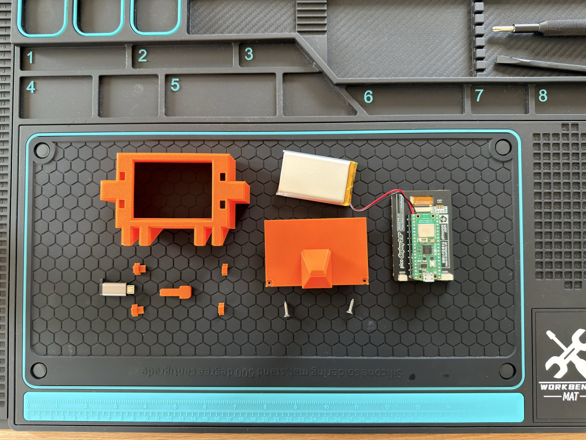

---

## 2. Print the case

Six parts, all small. I printed mine in **ABS on a Bambu P1S with default settings**. ABS because that's the only orange filament I had — PLA in your colour of choice will be fine, the case has no thermal duty.

Orientation:

- **Main body** — screen opening facing up. Supports under the side-button overhangs only.
- **Rear panel with tail** — flat back on the bed, tail facing up. No supports.
- **Battery clip** — flat side down. No supports.
- **Three buttons** — cap up, stem pointing into the build plate. No supports. Batch all three on the same plate.

If you want to change the geometry, edit the `.step` files. Things on my list for a v2: better tolerance on the side button stems, a deeper USB cutout so a wider range of cables fits, and somewhere proper for the battery to sit instead of glued clips.

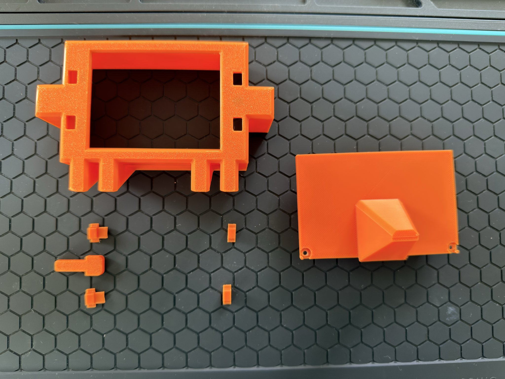

---

## 3. Build the Pico stack

Three boards: Pico 2 W → LiPo SHIM → Display Pack.

### 3.1 Dry-fit before soldering

With nothing soldered and no battery attached, push the Pico onto the Display Pack's female headers. It should seat with no force on the glass. If it doesn't sit flat, find what's obstructing it before going further.

### 3.2 Solder the LiPo SHIM

Pull the Pico off the display. Place the LiPo SHIM on the back of the Pico (opposite the RF can). The SHIM's silkscreen aligns with a subset of the Pico header pins. The JST connector ends up pointing away from the USB port.

Solder one pin at a time from the Pico side. Inspect under magnification for bridges when done — `VBUS`, `VSYS`, `3V3_EN`, `3V3` are the ones that turn a working build into a dead one. A multimeter in continuity mode takes a minute and saves hours.

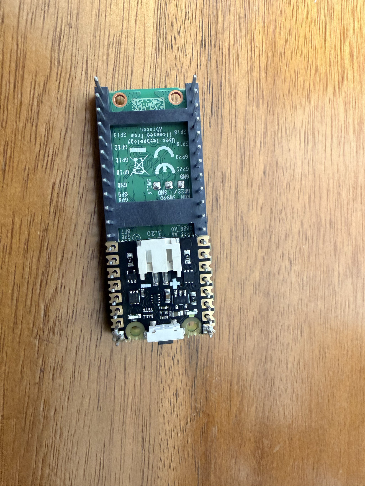

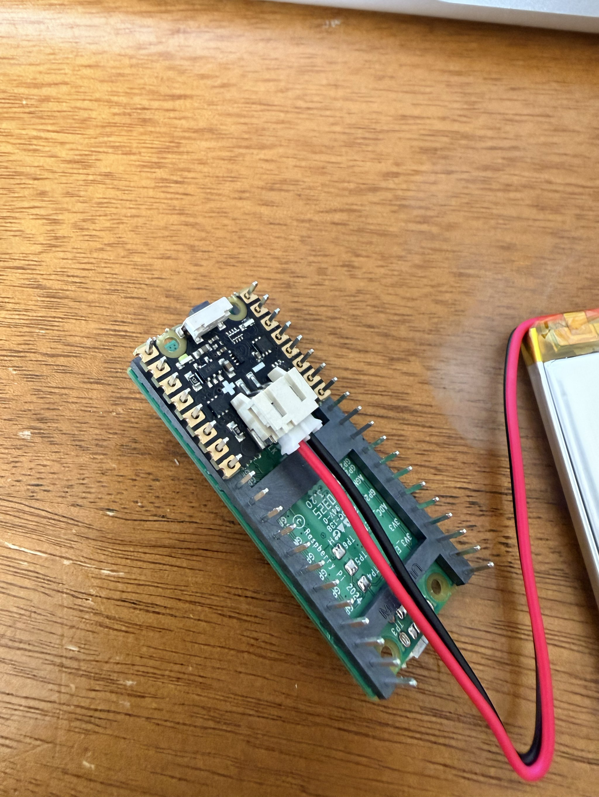

### 3.3 Refit the Pico into the display

Press the Pico-plus-SHIM stack back into the Display Pack. The display silkscreen reads upside-down when the USB port points up — that's the right orientation for this case.

---

## 4. Flash the firmware

Build it from the repo:

```bash
scripts/bootstrap_macos.sh      # one-time
scripts/clone_deps.sh           # one-time
scripts/configure_firmware.sh
cmake --build build/pico
```

This produces three UF2s. The full one is `build/pico/claude_buddy_pico.uf2` — that's what you want on the device. The other two (`claude_buddy_pico_smoke.uf2` and `claude_buddy_ble_smoke.uf2`) are diagnostic builds; ignore them unless something breaks, then see [Troubleshooting](#7-troubleshooting).

Flash:

1. Disconnect the battery.
2. Hold the SHIM's power button (or `BOOTSEL` on a minimum build).
3. Plug USB into your Mac.
4. Wait for the `RP2350` volume to mount.
5. `cp build/pico/claude_buddy_pico.uf2 /Volumes/RP2350/`

Toolchain detail in [../docs/software-setup.md](../docs/software-setup.md).

### Pair with Claude Desktop

1. Open Claude Desktop, enable Developer Mode.
2. `Developer → Open Hardware Buddy…`
3. `Connect`, pick `Claude Pico`, complete the passkey flow.

When pairing succeeds the Pico shows the linked state and reacts to Claude Desktop activity.

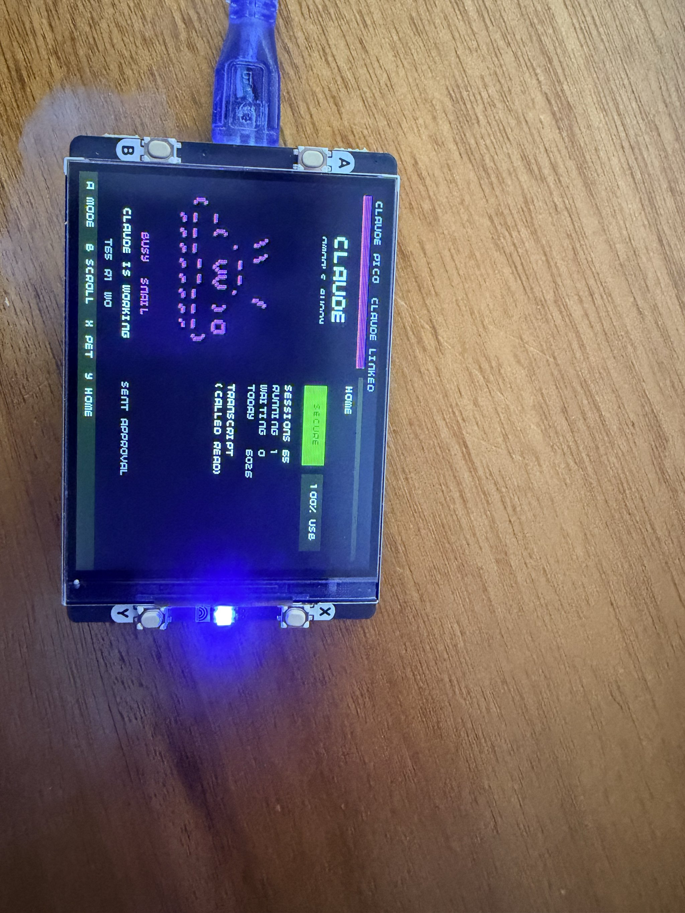

Before you assemble the case, leave the firmware running off battery for 15 minutes and confirm nothing gets warm. Thermal problems are much harder to diagnose once the case is closed.

---

## 5. Assemble the case

Six steps. Order matters — this sequence avoids the rework I did the first time round.

**Boot the firmware into the Pico/display board first** (step 4 above). You don't want to discover a bad solder joint after the case is screwed shut.

### 1. Drop the four side buttons into the main body

From the inside, push each printed button through its slot until the cap protrudes about 1 mm. They're a friction fit. Two on the left for `A` / `B`, two on the right for `X` / `Y`.

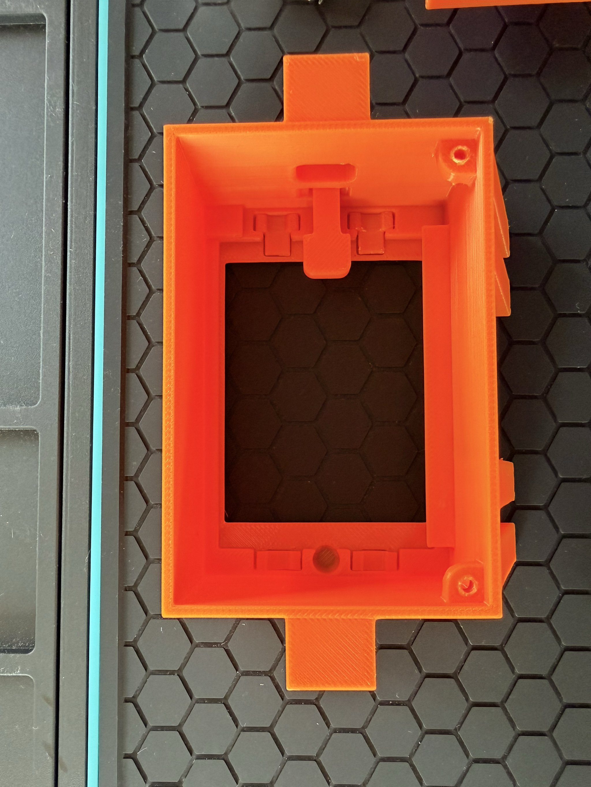

### 2. Slide the power button into its slot, all the way

The power button is the printed actuator for the LiPo SHIM's side button. Slide it in fully so it bottoms out.

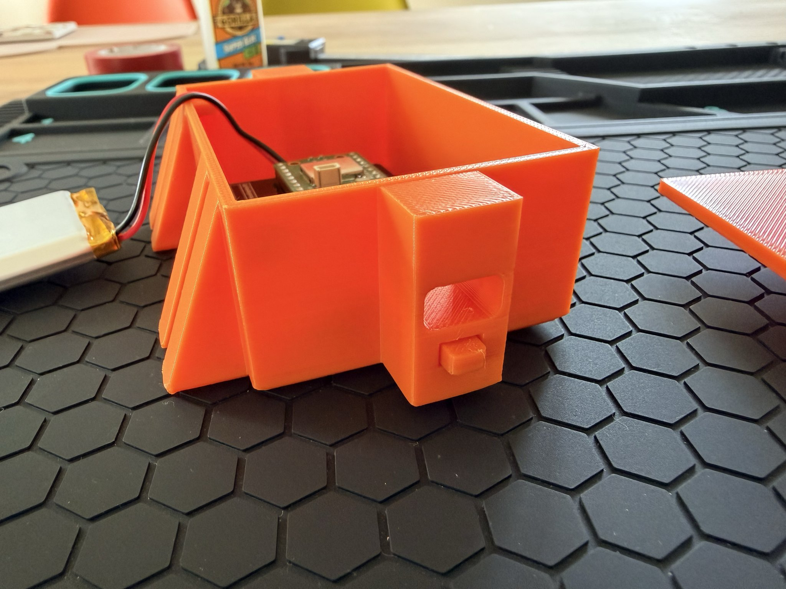

### 3. Angle the assembled Pico/display board into the case

Tilt the stack in display-first, then press down — it'll snap fit. The display glass should land flat against the screen window.

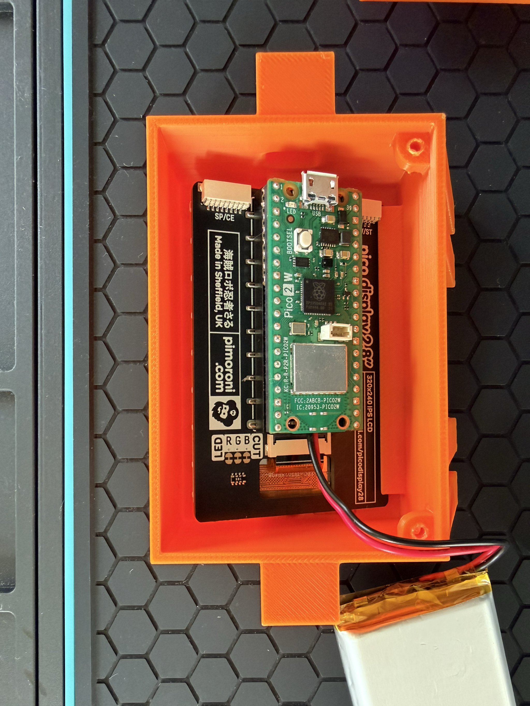

### 4. Push the USB connector through the left-hand cutout

Push the USB-C adapter (or the micro plug) through the cutout on the left. If the adapter doesn't line up cleanly, push the Pico further in or pull it back a touch — the stack has a loose fit, it'll find the right position.

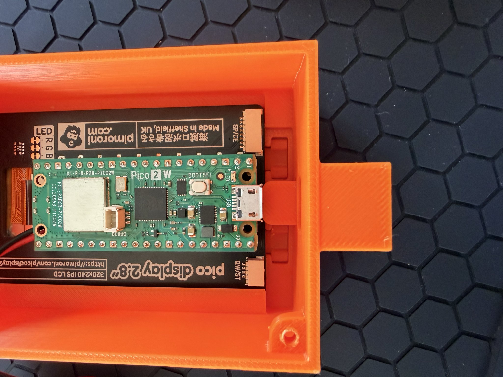

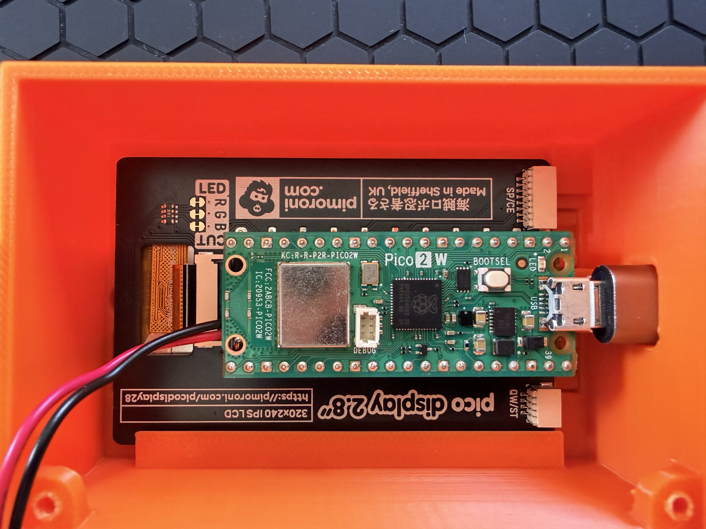

### 5. Slide the battery into the rear case

The battery clip is glued to the inside of the rear panel (see note below). Slide the battery into the clip. Route the JST lead toward the SHIM end so the wire doesn't sit across the RF can.

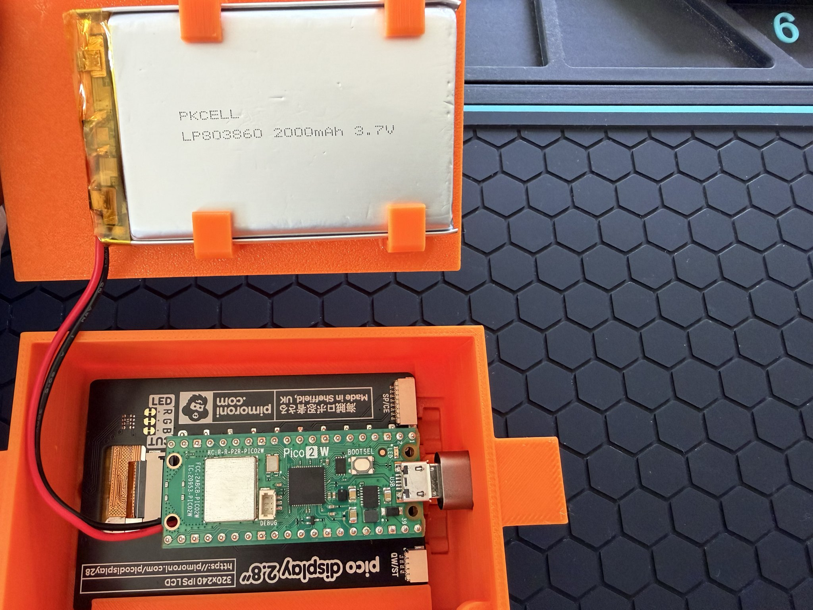

**About the battery clip.** I got tired and glued the clips directly to the back of the rear case with super glue. It works. A proper integrated retainer in the rear panel would be better and is on the v2 list — pull request welcome.

### 6. Two M3 × 12 screws

Bring the rear panel up to the main body, tail pointing down. The screws go through the rear flanges of the main body into the screw posts on the rear panel. Hand-tight only — overtightening will split the printed posts. If a screw feels gritty going in, back out and re-start; you're cross-threading.

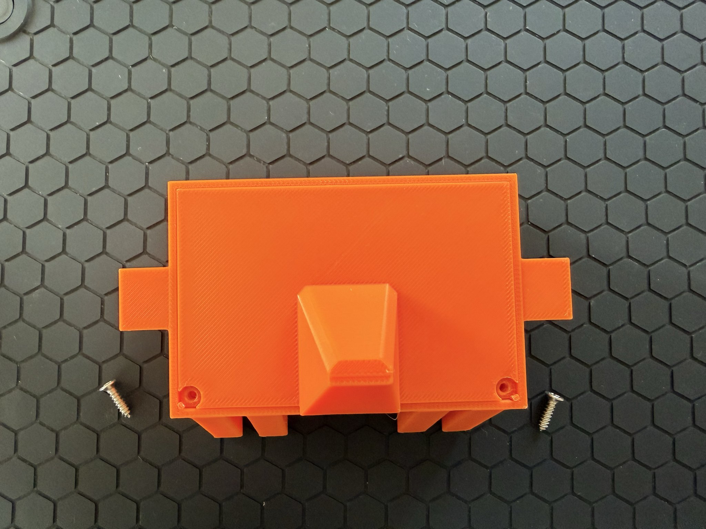

Done.

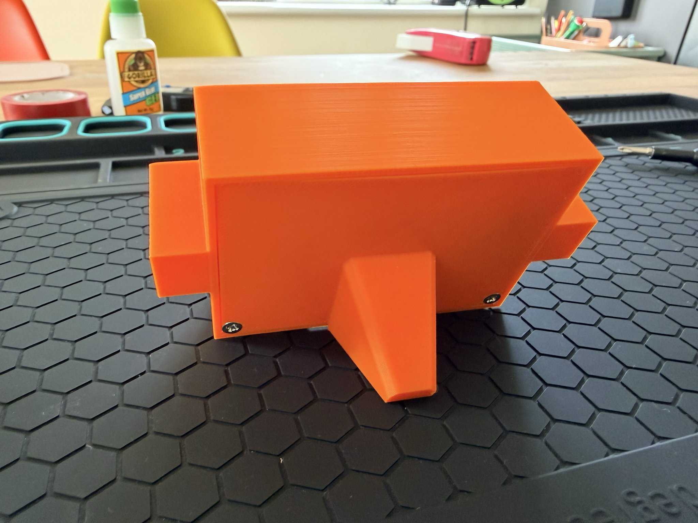

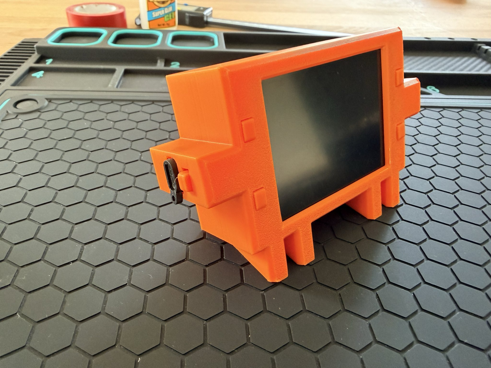

---

## 6. First power-on from the case

Plug in USB, or press the SHIM power button if the battery is charged.

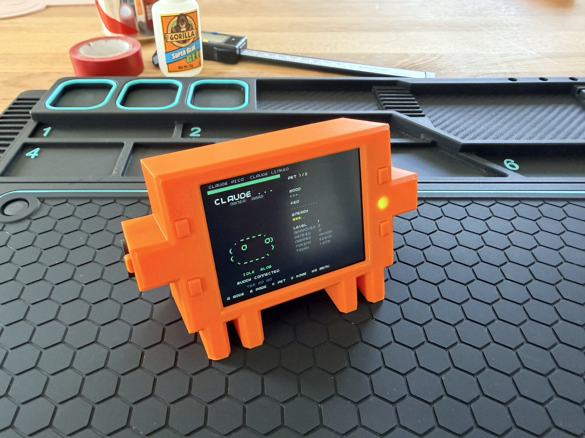

`A` / `B` step through screens, `X` / `Y` jump to Pet and Home. `Hold A` opens settings, `Hold Y` puts the buddy to sleep. Full reference: [../README.md#button-map](../README.md).

---

## 7. Troubleshooting

If the build came up clean on first power-on, you're done. The rest of this section is for when it doesn't.

### The smoke-test ladder

The firmware ships as three UF2s in increasing complexity. If the full firmware misbehaves, walk down the ladder until you find the first one that works — that tells you which layer is broken.

- `claude_buddy_pico_smoke.uf2` — just the hardware. Display, buttons, VSYS, USB sense, uptime.
- `claude_buddy_ble_smoke.uf2` — adds the BLE radio and protocol.
- `claude_buddy_pico.uf2` — the full firmware.

Flash the same way as the main firmware. The hardware smoke test should show `CLAUDE BUDDY PICO SMOKE TEST`, a non-zero `VSYS` reading, `USB SENSE: ON`, an uptime counter, and per-button `HIT` indicators when you press `A` / `B` / `X` / `Y`.

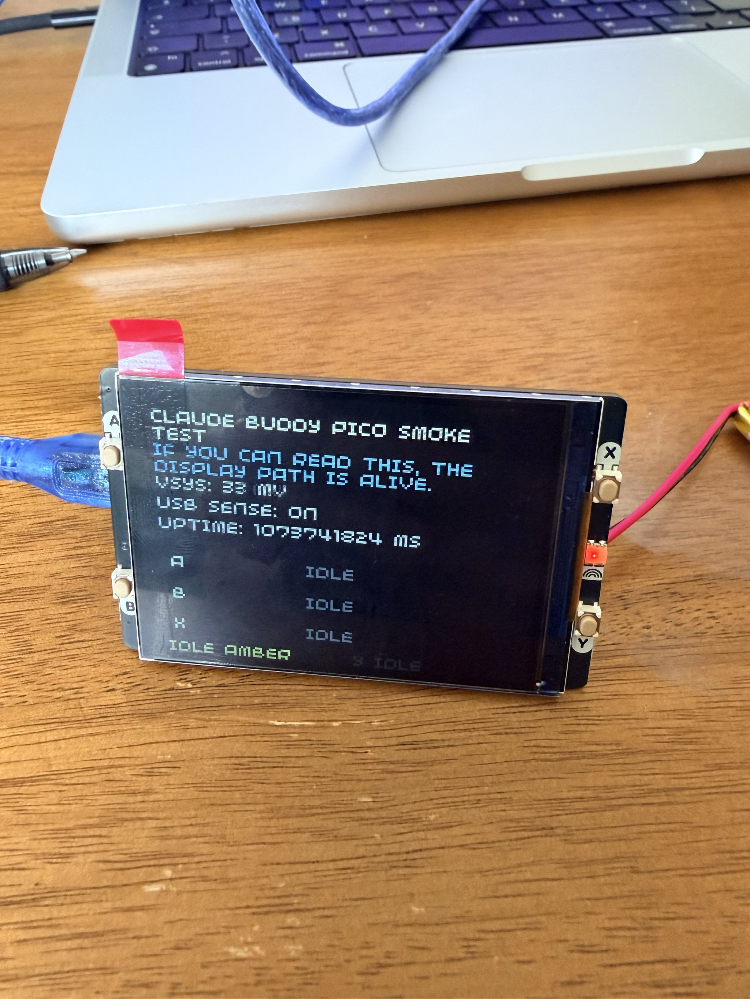

The BLE smoke test should show `ADVERTISING` and a name field of `Claude Pico`.

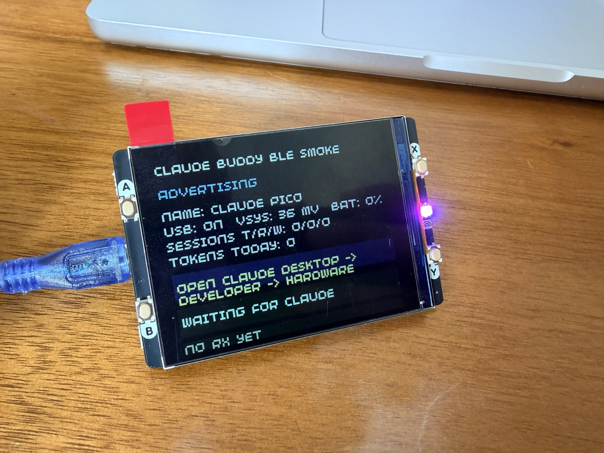

### Specific failures

- **`BOOTSEL` recovery is flaky with the battery attached.** Known LiPo SHIM behaviour, not a firmware bug. Either disconnect the battery before reflashing, or use the battery-connected sequence: plug USB, hold `BOOTSEL`, also hold the SHIM side button near the USB end, wait for the `RP2350` volume.
- **Display shows garbage after flashing.** Re-flash the hardware smoke test. If that's also broken, the headers between Pico and display aren't making clean contact. Re-seat the stack.
- **Pairs but never gets past `ADVERTISING`.** Developer Mode off in Claude Desktop, or you're on a Claude Desktop build that doesn't expose Hardware Buddy yet. Not a firmware problem.
- **Battery feels warm.** Disconnect immediately. Inspect SHIM solder for bridges around `VBUS` / `VSYS` / `3V3`. Don't reconnect until you've found the bridge.
- **Buttons sticky after assembly.** Case walls shaving the printed stems. Open up, sand stems with 400-grit, reinstall.

---

## 8. What to do next

- **Build the minimum version first** if you're unsure — Pico + Display + USB cable. That tells you whether the firmware works on your hardware before you commit to the SHIM solder.
- **Open the `.step` files** in Fusion / FreeCAD / Onshape. The case is one weekend's work and has obvious improvements waiting (battery retainer, USB cutout depth, button stem tolerance). Fork it.
- **Post your build.** Photos of someone else's print in a different colour with a different battery would be more useful for the next builder than anything I can write.

---

## Credits and licence

- Upstream BLE Hardware Buddy protocol: [anthropics/claude-desktop-buddy](https://github.com/anthropics/claude-desktop-buddy).
- Pico firmware port, case design, build notes: this repo.
- Mascot: Clawd, Anthropic.
- Licence: see [../LICENSE](../LICENSE).
