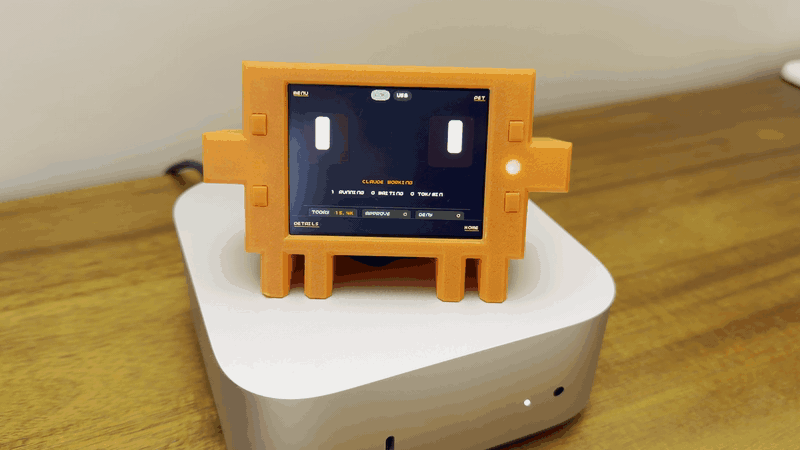

# Claude Buddy Pico

Una mascota divertida y juguetona de Claude Code que cobra vida con una carcasa impresa en 3D, portando el compañero original de Claude Desktop de Felix Rieseberg desde el hardware M5 ESP32 a una construcción personalizada de Raspberry Pi Pico con una pantalla más grande de 2.8". Claude Pico se coloca junto a tu Mac, aprueba llamadas a herramientas para [Claude Desktop](https://claude.ai/download) por Bluetooth y reacciona a lo que hace Claude con una cara que parece viva. Un botón aprueba, otro niega, y la batería recargable integrada te permite llevarlo por la oficina o la casa para vigilar el progreso mientras continúas con tu día.



Portación no oficial de la comunidad. No producido ni respaldado por Anthropic. Atribución en [NOTICE](NOTICE).

<p align="center">
  
  &nbsp;
  
</p>

Proyecto original: [anthropics/claude-desktop-buddy](https://github.com/anthropics/claude-desktop-buddy). Autor original: [Felix Rieseberg](https://github.com/anthropics/claude-desktop-buddy/commits?author=felixrieseberg).

## Qué es

- Raspberry Pi Pico 2 W + Pimoroni Display Pack 2.8 + LiPo SHIM y batería de 2000 mAh opcionales.
- Se empareja con Claude Desktop mediante Bluetooth Low Energy utilizando el protocolo Hardware Buddy.
- Se ejecuta conectado por USB o de forma autónoma con la batería opcional.
- Carcasa impresa en 3D con forma de Clawd. Archivos CAD en `.step` (editable) y `.stl` (imprimible).
- Licencia MIT; se aceptan mejoras y correcciones.

## Elige un camino

| Si quieres… | Comienza aquí |
|---|---|
| Construir uno | [Physical Build/BUILD_GUIDE.md](Physical%20Build/BUILD_GUIDE.md) |
| Imprimir la carcasa | [Physical Build/CAD/](Physical%20Build/CAD) — GitHub renderiza `.stl` en línea |
| Flashear el firmware | [docs/software-setup.md](docs/software-setup.md) |
| Entender qué cambió respecto al proyecto original | [docs/feature-matrix.md](docs/feature-matrix.md) |

## Qué cambió respecto al proyecto original

Tres cambios son importantes; el resto está en [`docs/feature-matrix.md`](docs/feature-matrix.md):

- **Pantalla horizontal 320×240 en lugar de la pantalla vertical del M5Stick.** La interfaz V2 es nativa de Pico, no una copia píxel a píxel de la original.
- **Cuatro botones frontales `A / B / X / Y` reemplazan la semántica del botón de encendido del M5Stick.** El botón del LiPo SHIM permanece solo a nivel de hardware.
- **Sin IMU.** El gesto de agitar para marearse se convirtió en `Mantener X`; la siesta boca abajo se convirtió en `Mantener Y`. Los gestos son explícitos.

El propio protocolo BLE Hardware Buddy no ha cambiado: este dispositivo se empareja con una sesión estándar de Hardware Buddy de Claude Desktop.

## Controles

- `A`: siguiente pantalla, aprobar solicitud, avanzar selección
- `B`: siguiente página, siguiente fragmento de transcripción, denegar solicitud
- `X`: siguiente mascota, detalles crudos de la solicitud durante aprobaciones
- `Y`: inicio / atrás
- `Mantener A`: abrir el menú principal
- `Mantener X`: huevo de pascua `dizzy` (mareo)
- `Mantener Y`: siesta / despertar
- `Botón LiPo SHIM`: solo encendido/apagado de hardware, nunca entrada de la aplicación

Mapa completo pantalla por pantalla en [`docs/user-guide.md`](docs/user-guide.md).

## Limitaciones conocidas

- **Paquetes de personajes GIF no implementados.** El protocolo de transferencia de red funciona y los manifiestos `text` se renderizan en el dispositivo; portar el renderizador GIF del proyecto original al Pico es trabajo futuro.
- **El porcentaje de batería se estima desde el voltaje VSYS.** No hay ruta de sentido de corriente en esta construcción, por lo que es una aproximación por curva de voltaje, no conteo de culombios.
- **La carcasa es v1.** Mejoras obvias: un retenedor de batería integrado adecuado en lugar de grapas pegadas, un corte más profundo para USB, tolerancia más ajustada para el vástago de los botones. Los archivos `.step` están en el repositorio. Haz un fork de la carcasa y abre un PR — la lista de v2 está en la guía de construcción.
- **Control de características de Hardware Buddy.** Si `Developer → Open Hardware Buddy…` falta, estás usando una versión de Claude Desktop que aún no expone la función: se trata de un tema del host, no del firmware.

## Firmware: dos caminos

Hay dos formas de compilar el firmware principal desde el mismo objetivo `claude_buddy_pico`. Ambos hablan el mismo protocolo BLE y se emparejan con Claude Desktop de la misma manera. Solo difieren en la interfaz de usuario en el dispositivo.

- **Camino principal — V2 con animaciones del compañero (predeterminado).** Expresiones faciales, mascota animada, reloj de dock, pantallas de aprobación, registro de permisos. Se compila con `BUDDY_UI_V2=1`, que está activado por defecto.
- **Camino básico — V1 monolítico (alternativa).** La interfaz de usuario original de un solo archivo de las primeras etapas de puesta en marcha. Misma pila BLE, pantallas más simples, sin animaciones. Actívalo con `-DBUDDY_UI_V2=OFF` al configurar. Útil si estás depurando la capa BLE y quieres la interfaz fuera del camino.

## Compilación

Cadena de herramientas para macOS:

```bash
scripts/bootstrap_macos.sh       # ejecución única
scripts/clone_deps.sh            # ejecución única
scripts/configure_firmware.sh    # camino principal V2 (predeterminado)
cmake --build build/pico
```

Para el camino básico V1, configura con la bandera desactivada:

```bash
cmake -S . -B build/pico -DBUDDY_UI_V2=OFF
cmake --build build/pico
```

Cualquier paso de configuración produce `claude_buddy_pico.uf2` — la bandera solo cambia qué interfaz se compila.

### Compilaciones de diagnóstico

La misma compilación también emite tres UF2 de prueba rápida (smoke test). Solo flashea estos si algo falla:

- `claude_buddy_pico_smoke.uf2` — prueba rápida de hardware (pantalla, botones, LED)
- `claude_buddy_ble_smoke.uf2` — prueba rápida de BLE/protocolo
- `claude_buddy_pico_v2_smoke.uf2` — renderizador de interfaz V2 aislado, sin BLE

Si la instalación de la cadena de herramientas embebida de Homebrew falla en tu máquina, `scripts/extract_local_toolchain.sh` extrae una alternativa local para el espacio de trabajo. Detalles completos en [`docs/software-setup.md`](docs/software-setup.md).

## Flashear

1. Desconecta la batería.
2. Mantén presionado `BOOTSEL`.
3. Conecta el USB a tu Mac.
4. `cp build/pico/claude_buddy_pico.uf2 /Volumes/RP2350/`

La recuperación con `BOOTSEL` y la batería conectada es inestable en el LiPo SHIM. El procedimiento de recuperación con batería conectada y todos los detalles están en [`docs/hardware-build.md`](docs/hardware-build.md).

## Emparejar con Claude Desktop

1. Habilita el Modo Desarrollador en Claude Desktop.
2. `Developer → Open Hardware Buddy…`
3. `Connect` → selecciona `Claude Pico` → completa el flujo de clave de acceso.

## Estructura del repositorio

- `src/` — objetivos de firmware activos y renderizador de personajes
- `src/ui_v2/` — motor de interfaz V2, pantallas, paleta, sistema de cara, transiciones
- `src/_legacy/` — estructura base de puesta en marcha archivada, no forma parte de la compilación actual
- `docs/` — notas de protocolo, matriz de características, limitaciones y guía de usuario
- `Physical Build/` — CAD, carcasa imprimible y guía de construcción de hardware
- `scripts/` — scripts auxiliares de inicialización, dependencias y configuración
- `third_party/` — clones de SDK de terceros
- `toolchains/` — cadena de herramientas embebida local opcional

## Qué hacer a continuación

- **Construye primero la versión mínima** — Pico 2 W + Display Pack + cable USB. Eso demuestra que el firmware funciona en tu hardware antes de comprometerse con la soldadura del SHIM.
- **Abre los archivos `.step`** en Fusion / FreeCAD / Onshape. Haz un fork de la carcasa y abre un PR — la lista de v2 está en la guía de construcción.

## Créditos

El protocolo BLE Hardware Buddy y el firmware original del M5Stick son obra de Anthropic y se publican en [anthropics/claude-desktop-buddy](https://github.com/anthropics/claude-desktop-buddy). La implementación original de Felix Rieseberg es la base de esta portación. Consulta [NOTICE](NOTICE) para detalles de atribución.

## Licencia

MIT. Consulta [LICENSE](LICENSE).
