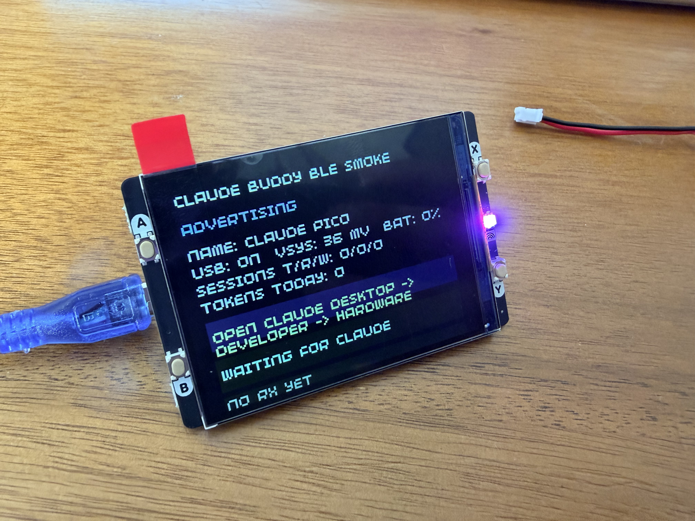

# Claude Desktop Buddy Pico

Pico-first port of [anthropics/claude-desktop-buddy](https://github.com/anthropics/claude-desktop-buddy) for a `Raspberry Pi Pico 2 W` with a `Pimoroni Pico Display Pack 2.8`.

This repo keeps Anthropic's Hardware Buddy BLE protocol and the original Buddy interaction model, but adapts it to the Pico hardware on purpose:

- `320x240` landscape screen instead of the M5Stick portrait display
- four front buttons: `A / B / X / Y`
- RGB LED on the display pack
- LiPo SHIM button stays hardware-only
- no IMU, no speaker



## Hardware

This repo targets the following prototype build:

- `Raspberry Pi Pico 2 W` with headers
- `Pimoroni Pico Display Pack 2.8` (`PIM715`)
- `Pimoroni LiPo SHIM for Pico` (`PIM557`)
- `Pimoroni 2000mAh LiPo` (`BAT0005`)
- micro-USB data cable

The assembly order that worked best for this exact stack:

1. Dry-fit the Pico into the display with no battery attached.
2. Remove the display and solder the LiPo SHIM to the back of the Pico.
3. Refit the Pico to the display.
4. Boot from USB only first.
5. Connect the battery only after USB bring-up succeeds.

The most important real-world note: with the battery attached, `BOOTSEL` recovery was unreliable over a simple unplug/replug. The safest fallback was still to disconnect the battery first, then hold `BOOTSEL` while plugging USB into the Mac, but a battery-connected method also worked here: plug USB in first, then hold `BOOTSEL` and the LiPo SHIM side button near the USB end until `RP2350` appears. Full build notes live in [docs/hardware-build.md](docs/hardware-build.md).

## What Works

Current main firmware target: `claude_buddy_pico`

- Pimoroni display, buttons, and RGB LED
- BLE discovery as `Claude Pico`
- secure pairing flow with Claude Desktop Hardware Buddy
- Buddy-style `Home`, `Pet`, and `Info` screens
- prompt approval on-device with `A approve` / `B deny`
- `Hold A` menu, `Hold Y` nap, `Hold X` dizzy easter egg
- dock clock mode on USB when a time sync has been received
- demo mode
- persisted settings, stats, owner/device name, and selected pet
- built-in ASCII species plus one installed pushed character pack
- `status`, `name`, `owner`, `species`, `unpair`, `char_begin`, `file`, `chunk`, `file_end`, `char_end`

Firmware ladder:

- `claude_buddy_pico_smoke.uf2`: hardware smoke test
- `claude_buddy_ble_smoke.uf2`: BLE/protocol smoke test
- `claude_buddy_pico.uf2`: full Pico Buddy firmware

## What Changed From Upstream

This is not a strict line-for-line port of the M5Stick firmware.

What stayed aligned with upstream:

- Hardware Buddy BLE/NUS protocol
- main Buddy states: `sleep`, `idle`, `busy`, `attention`, `celebrate`, `dizzy`, `heart`
- approval flow and Buddy-style pet personality
- main menu structure: `settings`, `screen off`, `help`, `about`, `demo`, `close`
- single installed external character pack model

What changed for Pico:

- `Y` replaces the original power/menu semantics for home/back
- `Hold Y` replaces face-down nap
- `Hold X` replaces shake-to-dizzy
- dock clock is fixed landscape only
- the larger screen uses a left pet column, right info rail, and centered overlays

## Button Map

- `A`: next main screen, approve prompt, advance selection in overlays
- `B`: next page/transcript chunk, deny prompt, confirm selection in overlays
- `X`: cycle pet normally, toggle raw prompt details on approval overlays
- `Y`: home / back out of overlays
- `Hold A`: open or close the main menu
- `Hold X`: trigger `dizzy`
- `Hold Y`: nap / wake
- `LiPo SHIM button`: hardware-only power control

More detail is in [docs/protocol-map.md](docs/protocol-map.md).

For day-to-day use of the finished firmware, see [docs/user-guide.md](docs/user-guide.md).

## Settings, Names, And LED Behavior

- `Hold A` opens the on-device menu and settings overlay.
- The `Name` field in Claude Desktop Hardware Buddy changes the large device name shown on the Pico.
- The smaller owner line comes from the Buddy `owner` value sent by Claude Desktop or the bridge, so each builder's own name appears there.
- LED meanings:
  - `off`: asleep or not linked
  - `green`: linked and idle
  - `blue`: Claude is running work
  - `amber`: approval pending
  - `magenta`: pairing or character install
  - `red`: low battery

## Build

### macOS toolchain

```bash
scripts/bootstrap_macos.sh
scripts/clone_deps.sh
scripts/configure_firmware.sh
cmake --build build/pico
```

If Homebrew's embedded toolchain install is incomplete on your machine, extract the workspace-local fallback:

```bash
scripts/extract_local_toolchain.sh
```

### Flash

Reliable flash flow for this prototype:

1. Disconnect the battery from the LiPo SHIM.
2. Hold the Pico `BOOTSEL` button.
3. Plug USB into the Mac.
4. Wait for the `RP2350` volume to mount.
5. Copy the desired UF2 to `RP2350`.

Battery-connected alternative:

1. Plug USB into the Mac first.
2. Hold the Pico `BOOTSEL` button.
3. While holding `BOOTSEL`, hold the LiPo SHIM side button near the USB end.
4. Wait for `RP2350` to mount.

Example:

```bash
cp build/pico/claude_buddy_pico.uf2 /Volumes/RP2350/
```

## Pair With Claude Desktop

1. Put Claude Desktop in Developer Mode.
2. Open `Developer -> Open Hardware Buddy...`
3. Click `Connect`
4. Select `Claude Pico`
5. Complete the passkey flow if prompted

If the `Open Hardware Buddy...` menu item is missing on your Claude Desktop build, the feature may still be present in the installed app but hidden by runtime feature gating on that machine. In that case the problem is host-side, not firmware-side. The background and the recovery path that worked here are in [docs/bring-up-journal.md](docs/bring-up-journal.md).

Once paired, the Buddy window should show live status fields from the Pico and the device should react to heartbeat snapshots and approval requests.

## Character Packs

This Pico port supports one installed pushed character pack at a time in addition to the built-in ASCII species.

Today the Pico renderer supports installed `text` character manifests and persists them in flash. The full transfer wire protocol is implemented, but GIF-based pack rendering from the upstream ESP32 build is still future work for this repo.

For a first folder-push test, use [examples/character-packs/sunset_blob](examples/character-packs/sunset_blob). More detail is in [docs/folder-push.md](docs/folder-push.md).

## Repo Layout

- `src/`: active firmware targets and pet renderer
- `src/_legacy/`: archived modular scaffold from bring-up, not part of the current build
- `docs/`: builder docs, protocol notes, feature matrix, bring-up journal
- `scripts/`: bootstrap, dependency, and configure helpers
- `third_party/`: vendor SDK clones
- `toolchains/`: optional local embedded toolchain

## Docs

- [docs/hardware-build.md](docs/hardware-build.md)
- [docs/software-setup.md](docs/software-setup.md)
- [docs/user-guide.md](docs/user-guide.md)
- [docs/folder-push.md](docs/folder-push.md)
- [docs/protocol-map.md](docs/protocol-map.md)
- [docs/feature-matrix.md](docs/feature-matrix.md)
- [docs/limitations.md](docs/limitations.md)
- [docs/bring-up-journal.md](docs/bring-up-journal.md)

## Credits

The Hardware Buddy BLE protocol and the original M5Stick reference firmware are the work of Anthropic and are published at [anthropics/claude-desktop-buddy](https://github.com/anthropics/claude-desktop-buddy). This repo is an unofficial community port and is not produced, endorsed, or supported by Anthropic. See [NOTICE](NOTICE) for attribution details and [LICENSE](LICENSE) for license terms.

## License

Released under the MIT License. See [LICENSE](LICENSE).
