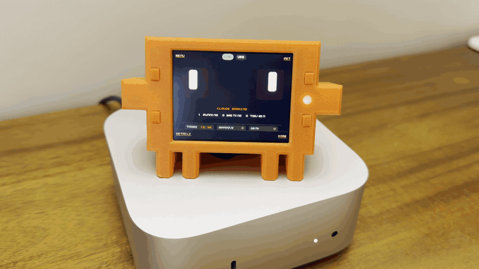

# Claude Buddy Pico

A fun, playful Claude Code mascot brought to life with a 3D-printed case by porting Felix Rieseberg's original Claude Desktop buddy from the M5 ESP32 hardware to a custom Raspberry Pi Pico build with a bigger 2.8" display. Claude Pico sits next to your Mac, approves tool calls for [Claude Desktop](https://claude.ai/download) over Bluetooth, and reacts to what Claude is doing with a face that feels alive. One button approves, another denies, and the built-in rechargeable battery lets you take it around the office or house to keep an eye on things while you get on with your day.



Unofficial community port. Not produced or endorsed by Anthropic. Attribution in [NOTICE](NOTICE).

<p align="center">
  
  &nbsp;
  
</p>

Upstream: [anthropics/claude-desktop-buddy](https://github.com/anthropics/claude-desktop-buddy). Original author: [Felix Rieseberg](https://github.com/anthropics/claude-desktop-buddy/commits?author=felixrieseberg).

## What it is

- Raspberry Pi Pico 2 W + Pimoroni Display Pack 2.8 + optional LiPo SHIM and 2000 mAh battery.
- Pairs with Claude Desktop over Bluetooth Low Energy using the Hardware Buddy protocol.
- Runs tethered on USB, or untethered with the optional battery.
- 3D-printed case in the shape of Clawd. CAD in both `.step` (editable) and `.stl` (printable).
- MIT licensed; improvements and fixes are welcome.

## Pick a path

| If you want to… | Start here |
|---|---|
| Build one | [Physical Build/BUILD_GUIDE.md](Physical%20Build/BUILD_GUIDE.md) |
| Print the case | [Physical Build/CAD/](Physical%20Build/CAD) — GitHub renders `.stl` inline |
| Flash the firmware | [docs/software-setup.md](docs/software-setup.md) |
| Understand what changed from upstream | [docs/feature-matrix.md](docs/feature-matrix.md) |

## What changed from upstream

Three things matter; the rest is in [`docs/feature-matrix.md`](docs/feature-matrix.md):

- **Landscape 320×240 instead of the M5Stick portrait display.** The V2 UI is Pico-native, not a pixel copy of the original.
- **Four front buttons `A / B / X / Y` replace the M5Stick power-button semantics.** The LiPo SHIM button stays hardware-only.
- **No IMU.** Shake-to-dizzy became `Hold X`; face-down nap became `Hold Y`. Gestures are explicit.

The BLE Hardware Buddy protocol itself is unchanged — this device pairs with a stock Claude Desktop Hardware Buddy session.

## Controls

- `A`: next screen, approve prompt, advance selection
- `B`: next page, next transcript chunk, deny prompt
- `X`: next pet, raw prompt details during approvals
- `Y`: home / back
- `Hold A`: open the main menu
- `Hold X`: `dizzy` easter egg
- `Hold Y`: nap / wake
- `LiPo SHIM button`: hardware power only, never app input

Full screen-by-screen map in [`docs/user-guide.md`](docs/user-guide.md).

## Known limits

- **GIF character packs not implemented.** The transfer wire protocol works and `text` manifests render on-device; porting the upstream GIF renderer to the Pico is future work.
- **Battery percent is estimated from VSYS voltage.** No current-sense path on this build, so it's a voltage-curve approximation, not coulomb counting.
- **Case is v1.** Obvious things to improve: a proper integrated battery retainer instead of glued clips, a deeper USB cutout, tighter button-stem tolerance. The `.step` files are in the repo. Fork the case and open a PR — the v2 list is in the build guide.
- **Hardware Buddy feature gating.** If `Developer → Open Hardware Buddy…` is missing, you're on a Claude Desktop build that doesn't expose the feature yet — host-side, not firmware.

## Firmware — two paths

There are two ways to build the main firmware from the same `claude_buddy_pico` target. Both speak the same BLE protocol and pair with Claude Desktop the same way. They differ only in the on-device UI.

- **Main path — V2 with buddy animations (default).** Face expressions, animated pet, dock clock, approval screens, permissions log. Built with `BUDDY_UI_V2=1`, which is on by default.
- **Basic path — V1 monolith (fallback).** The original single-file UI from early bringup. Same BLE stack, simpler screens, no animations. Opt in with `-DBUDDY_UI_V2=OFF` at configure time. Useful if you're debugging the BLE layer and want the UI out of the way.

## Build

macOS toolchain:

```bash
scripts/bootstrap_macos.sh       # one-time
scripts/clone_deps.sh            # one-time
scripts/configure_firmware.sh    # V2 main path (default)
cmake --build build/pico
```

For the V1 basic path, configure with the flag off:

```bash
cmake -S . -B build/pico -DBUDDY_UI_V2=OFF
cmake --build build/pico
```

Either configure step produces `claude_buddy_pico.uf2` — the flag only changes which UI gets compiled in.

### Diagnostic builds

The same build also emits three smoke-test UF2s. Only flash these if something is wrong:

- `claude_buddy_pico_smoke.uf2` — hardware smoke test (display, buttons, LED)
- `claude_buddy_ble_smoke.uf2` — BLE/protocol smoke test
- `claude_buddy_pico_v2_smoke.uf2` — isolated V2 UI renderer, no BLE

If Homebrew's embedded toolchain install fails on your machine, `scripts/extract_local_toolchain.sh` extracts a workspace-local fallback. Full detail in [`docs/software-setup.md`](docs/software-setup.md).

## Flash

1. Disconnect the battery.
2. Hold `BOOTSEL`.
3. Plug USB into your Mac.
4. `cp build/pico/claude_buddy_pico.uf2 /Volumes/RP2350/`

`BOOTSEL` recovery with the battery attached is flaky on the LiPo SHIM. The battery-connected recovery path and the full story are in [`docs/hardware-build.md`](docs/hardware-build.md).

## Pair with Claude Desktop

1. Enable Developer Mode in Claude Desktop.
2. `Developer → Open Hardware Buddy…`
3. `Connect` → select `Claude Pico` → complete the passkey flow.

## Repo layout

- `src/` — active firmware targets and character renderer
- `src/ui_v2/` — V2 UI engine, screens, palette, face system, transitions
- `src/_legacy/` — archived bringup scaffold, not part of the current build
- `docs/` — protocol notes, feature matrix, limitations, and user guide
- `Physical Build/` — CAD, printable case, and the hardware build guide
- `scripts/` — bootstrap, dependency, and configure helpers
- `third_party/` — vendor SDK clones
- `toolchains/` — optional workspace-local embedded toolchain

## What to do next

- **Build the minimum version first** — Pico 2 W + Display Pack + USB cable. That proves the firmware works on your hardware before you commit to the SHIM solder.
- **Open the `.step` files** in Fusion / FreeCAD / Onshape. Fork the case and open a PR — the v2 list is in the build guide.

## Credits

The Hardware Buddy BLE protocol and the original M5Stick firmware are the work of Anthropic and are published at [anthropics/claude-desktop-buddy](https://github.com/anthropics/claude-desktop-buddy). Felix Rieseberg's original implementation is the foundation for this port. See [NOTICE](NOTICE) for attribution details.

## License

MIT. See [LICENSE](LICENSE).
